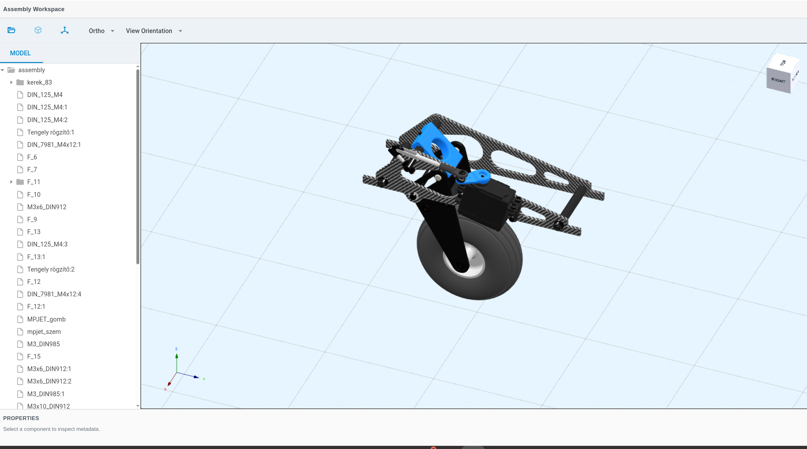

# 3D Assembly Inspector

[](LICENSE)
[](https://cadt2.github.io/3d-assembly-inspector/)
[](https://github.com/cadt2/3d-assembly-inspector/releases/tag/v0.5.1)

*Optimized for desktop interaction using mouse-based controls.*

Interactive web-based system for exploring, analyzing, and structuring 3D assemblies through a CAD-inspired interface.

---

## Interaction Guide

Use these controls once a model is loaded:

- **Left click on a part**: select part or sub-assembly  
- **Mouse wheel**: zoom in and out  
- **Middle mouse drag**: pan  
- **Shift + middle mouse drag**: orbit camera around target  

---

## Live Demo

https://cadt2.github.io/3d-assembly-inspector/  
(Runs directly in the browser — no installation required)

---

## Overview

**3D Assembly Inspector** is a browser-based application designed to bring CAD-style assembly interaction into modern web environments.

The system combines:

- structured assembly data  
- real-time 3D visualization  
- interaction-driven workflows  

into a unified platform capable of supporting engineering, inspection, and documentation use cases.

---

## Interface Preview



---

## System Capabilities

- Hierarchical assembly navigation (tree-based structure)  
- Real-time 3D interaction using WebGL (BabylonJS)  
- Part and sub-assembly identification  
- Isolation and inspection workflows  
- Logical interpretation of imported GLTF / GLB assemblies  
- Foundation for integration with engineering data systems  

---

## Engineering Focus

This system is designed as a browser-based engineering tool, not just a viewer.

Key areas of focus:

- Mapping CAD interaction patterns into web applications  
- Separating visualization, logic, and data layers  
- Designing scalable structures for assembly interpretation  
- Enabling future integration with backend systems and metadata  

---

## Current State — v0.5.1 (April 2026)

The application provides a stable, interactive CAD-style baseline with polished viewport controls and a navigation-first UX.

Recent improvements include:

- Default startup in isometric perspective view (matches AutoCAD/Inventor defaults)  
- Startup navigation modal with interaction guide (DHTMLX Window)  
- Distinct CAD-style icons for all View Orientation and projection controls  
- Structure-based hierarchy normalization across GLTF/GLB sources  
- Semantic label preservation when collapsing single-child technical nodes  
- Non-destructive selection highlighting (preserves material fidelity)  
- Modular architecture: each UI feature in its own dedicated module  

---

## Architecture Overview

```
┌─────────────────────────────────────────────────────┐
│                    UI Layer                         │
│  layout.js · toolbar.js · tree.js · viewMenu        │
├─────────────────────────────────────────────────────┤
│                  Logic Layer                        │
│  viewer3d.js · viewerEnvironment.js                 │
│  actions/ (isolate · select · view_fit_reset)       │
├─────────────────────────────────────────────────────┤
│                Rendering Layer                      │
│  BabylonJS (WebGL) · viewCubeFeature · axisTriad    │
│  modelBounds · GridMaterial                         │
└─────────────────────────────────────────────────────┘
```

---

## System Design Approach

The application follows a modular architecture separating:

- UI Layer — structured interface and interaction  
- Logic Layer — assembly interpretation and behavior  
- Rendering Layer — real-time 3D visualization  

This separation allows the system to scale toward:

- data-driven assemblies  
- backend integration  
- persistent storage  
- engineering workflows  

---

## Performance Direction (Next Phase)

The system is evolving toward a hybrid architecture where computation-heavy logic is decoupled from the browser interaction layer.

Planned direction includes:

- leveraging Rust for high-performance computation  
- exploring WebAssembly (WASM) for performance-critical workflows  
- enabling scalable handling of complex assemblies and geometry operations  

---

## Tech Stack

- JavaScript / TypeScript  
- BabylonJS (WebGL)  
- DHTMLX Suite  
- GLTF / GLB  
- HTML / CSS  

---

## License and Compliance

This repository is licensed under **GNU GPL v2.0**.

Copyright (C) 2026 cadt2

- Project license: see `LICENSE`
- Third-party inventory: see `THIRD_PARTY_LICENSES.md`
- DHTMLX Suite is loaded from CDN (`https://cdn.dhtmlx.com/suite/9.3/...`) and must be treated according to GPL-compatible distribution terms for this open project.

If this project is ever moved to a closed/proprietary distribution model, replace the GPL-dependent UI stack or acquire the corresponding commercial license before release.

---

## Viewer Module Convention

To keep the viewer maintainable as behaviors grow, this repository follows a strict folder rule:

- `viewer/actions/` contains only isolated viewer actions  
- Each action file must be named after the action it implements  
- Example pattern: `isolate_selection`, `select_selection`, `view_fit_reset`  
- Non-action modules must stay outside `viewer/actions/`  
- Shared helpers and orchestration stay in the viewer root (or another non-actions technical folder if introduced later)  

---

## Execution

1. Clone repository  
2. Run via local web server  
3. Load a GLB model  
4. Interact with the assembly  

---

## Portfolio Context

This system demonstrates the development of a web-based CAD-inspired application, combining:

- real-time 3D rendering  
- structured UI systems  
- engineering-oriented interaction design  
- scalable architecture for future system expansion  

---

## Final Result

A functional, browser-based CAD-style assembly inspector demonstrating:

- Engineering-grade 3D interaction patterns in a pure web stack  
- Real-time GLTF/GLB assembly exploration with hierarchical tree navigation  
- Modular, scalable architecture ready for backend integration  
- Clean separation between rendering, logic, and UI layers  

See the [live demo](https://cadt2.github.io/3d-assembly-inspector/) to interact with a real assembly.

This README presents the system as a structured, scalable engineering application aligned with web-based CAD development.